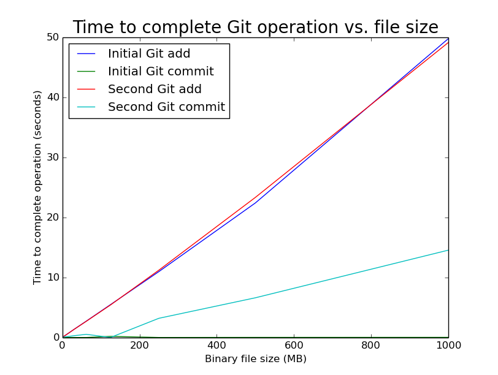
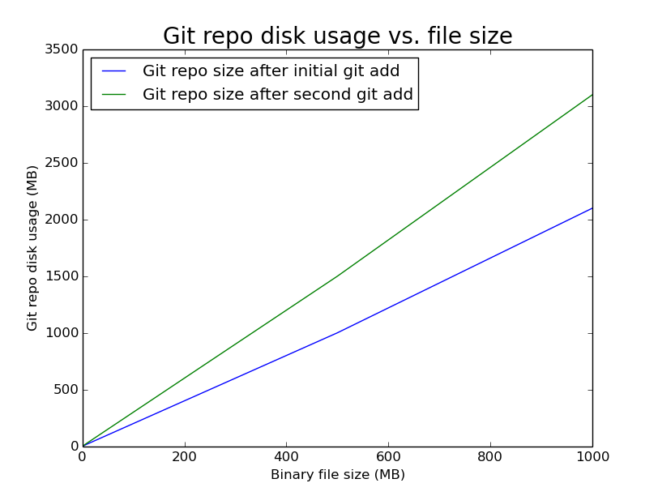

# GitBags

A GitBag is a [Bag](https://tools.ietf.org/html/draft-kunze-bagit-05) whose contents are versioned within a Git repository. The .git directory sits in the top-level Bag directory, alongside the Bag's tagfiles and /data directory. For example, for a Bag in a directory named 'mybagdir,' you have this:

```
mybagdir/
├── bag-info.txt
├── bagit.txt
├── data
│   ├── file1.txt
│   └── file2.txt
├── manifest-md5.txt
└── tagmanifest-md5.txt
```
By converting the Bag to a GitBag (i.e., by initializing a Git repo within the Bag directory), you get this:

```
mybagdir/
├── bag-info.txt
├── bagit.txt
├── data
│   ├── file1.txt
│   └── file2.txt
├── .git
│   ├── branches
│   ├── config
│   ├── description
│   ├── HEAD
│   ├── hooks
│   │   ├── applypatch-msg.sample
│   │   ├── commit-msg.sample
│   │   ├── post-update.sample
│   │   ├── pre-applypatch.sample
│   │   ├── pre-commit.sample
│   │   ├── prepare-commit-msg.sample
│   │   ├── pre-push.sample
│   │   ├── pre-rebase.sample
│   │   └── update.sample
│   ├── info
│   │   └── exclude
│   ├── objects
│   │   ├── info
│   │   └── pack
│   └── refs
│       ├── heads
│       └── tags
├── manifest-md5.txt
└── tagmanifest-md5.txt
```

## Why would you do this?

Several potential reasons:

1. you want to record all changes to the content (tagfiles and payload) of a Bag
1. you get a built-in tool for viewing the history of actions taken on a Bag: `git log` or `git reflog show`
1. the Bag can be cloned using any of Git's transport mechanisms, allowing easy duplication and synchronisation of Bags across networks and tracking of workflows using the reflog
1. Git's hooks offer a mechanism for logging to external services, email notifications, etc.

## Disadvantages

Some include:

1. since Git generates SHA1 checksums for all files, SHA1 checksums in BagIt manifests are redundant (but see "Are GitBags standard Bags?" below)
1. Git operations such as diff are not practical on binary files
1. Git is known not to scale well, so the larger the files in the Bag, the slower Git operations will be (but see "Light GitBags" below)
1. the size of a GitBag is larger than the equivalent non-Git Bag (also see "Light GitBags" below).

## Are GitBags standard Bags?

Yes. A GitBag is an ordinary Bag with a .git subdirectory within the top-level directory. Bags that contain .git directories validate, and if you remove the .git directory, the Bag still validates (which is why having those redundant SHA1 hashes around is good). 

## An example workflow

In this example, I want to modify the contents of the GitBag's payload (the files in its /data directory). Before I do anything to the GitBag's payload, I clone the GitBag to create a working copy. Then, I update the payload and regenerate the Bag (or update its manifests using my favorite BagIt tool). Next, I perform a `git commit` on the GitBag. Finally, I replace the original GitBag with the updated working copy. Here are those actions expressed as a series of steps I perform from within the GitBag's directory:

* `git clone mybagdir workingcopy`
* [Edit/modify the payload files]
* [Update the Bag's manifests]
* `commit -am "Did something important to the payload."`
* `mv workingcopy mybagdir`

(The cloning step and the replacing step are not required, I just included them as typical actions you may want to do.)

Later, I use `git log` or `git reflog show` to see the history of actions on the Bag:

```
2215aa5 HEAD@{0}: commit: Did something important to the payload.
3a7b3c0 HEAD@{1}: clone: from /path/to/original/mybagdir/
```

This workflow can easily be scripted. For instance, Python provides libraries for [creating Bags](https://github.com/LibraryOfCongress/bagit-python) and [manipulating Git repositories](https://gitorious.org/git-python). The script create_gitbag_sample.py illustrates a simple implementation that creates a GitBag.

There is one requirement in GitBag workflows: all Git operations need to be performed after the Bag has been created or modified. Otherwise, the .git directory will be added to the payload. You don't want this since 1) only the Bag's payload and not its manifests or tagfiles would be under Git's control and 2) you would likely invalidate your Bag if you performed any Git operations that write to its directory. So, in practice, you should always create the Bag first (or take an existing Bag), then initialize the Git repo, and modify the Bag's payload or tagfiles, then commit the changes using Git. Bag operations, then Git operations.

## Light GitBags

Even Linus Torvalds [admits](http://osdir.com/ml/git/2009-05/msg00051.html) that Git sucks at handling big files. The larger the file, the longer Git operations like `add` take. This is a problem, since it's common for Bags to contain a lot of large files.

To illustrate how Git handles large files, I created a set of 10 binary files ranging from 1 MB to 1000 MB and added each one to its own repo. I performed two sets of operations, the initial `add` and `commit`, and a second `add` and `commit` after the file was modified slightly (specifically, I added 10 bytes to the end of the file by running `truncate -s +10 filename`). The first graph below illustrates the relationship between size of files and the time it took to complete Git `add` and `commit` operations:



The larger the file being added, the longer the time Git takes to stage (`add`) it. `commit` operations do not take nearly as long, but they also increase proportionately with the size of the staged file.

Another issue with large files is that since Git stores a new copy of each file every time the file is modified, the disk usage of Git repos that contain large files can grow substantially if the files in the repo are modified frequently. This second graph shows the relationship between size of the file being added to the repo and the amount of disk storage consumed by the repo (which includes the original file and a copy for each version):



A Git  repo containing a single 1 GB file consumes 2 GB of disk space (one copy in the repo's working directory and one copy in its object store); after the file is modified once and added to the repo, the disk usage grows to 3 GB (one copy in the working directory and one copy in the repo's object store for each version). This test used compressed binary files; Git performs compression on the files when it can so in some cases the disk usage of the repo may be slightly less than is illustrated here.

One workaround for this set of problems is to create "light" GitBags. In a light GitBag, only the tagfiles (bag-info.txt, manfiest-md5.txt, etc.) are tracked in the Git repo; the payload files in the Bag's /data directory are not.  Git is able to track changes to payload files even if those files are not included in the Git repo because modifying the contents of a payload file will result in a new checksum for that file. Regenerating a Bag's manifests will update its manifest-md5.txt, manifest-sha1.txt, etc. (and bag-info.txt if you use the Payload-Oxum tag) correspondingly. The changes to the tagfiles document the changes to the payload files. 

So light GitBags solve the big file problem by not putting those files under Git's direct control. An additional benefit of this approach is that the Bag's size will not increase significantly with every change to the payload files, since the Git repo within the Bag stores previous versions of only the tagfiles.

Light GitBags have a couple of disadvantages, however:

1. since the payload files are not versioned, you will not be able to retrieve the contents of earlier versions of the files 
2. if you clone a light GitBag, the payload files will not be included in the clone (but you can copy and move the GitBag using normal operating system commands).

Here is an example of creating a light GitBag and modifying one of the Bag's payload files. I have a Bag with the following contents:

```
1930-02-10/
├── bag-info.txt
├── bagit.txt
├── data
│   ├── 1930-02-10-01.tif
│   ├── 1930-02-10-02.tif
│   ├── 1930-02-10-03.tif
│   ├── 1930-02-10-04.tif
│   ├── 1930-02-10-05.tif
│   ├── 1930-02-10-06.tif
│   ├── 1930-02-10-07.tif
│   ├── 1930-02-10-08.tif
│   ├── 1930-02-10-09.tif
│   ├── 1930-02-10-10.tif
│   ├── 1930-02-10-11.tif
│   ├── 1930-02-10-12.tif
│   └── mets.xml
├── manifest-md5.txt
└── tagmanifest-md5.txt
```

I convert this Bag to a GitBag by initializing a repo in the 1930-02-10 directory, and then `git add` only bagit.txt,  bag-info.txt, manifest-md5.txt, and tagmanifest-md5.txt. I then modify one of the payload files (in this example, data/1930-02-10-05.tif) and update the Bag's manifests using my favorite BagIt tool.

If I do a `git diff` on my GitBag after updating the manifests, I get the following:

```
diff --git a/bag-info.txt b/bag-info.txt
index e7e8f97..e306823 100644
--- a/bag-info.txt
+++ b/bag-info.txt
@@ -2,5 +2,5 @@ Bag-Software-Agent: bagit.py <http://github.com/edsu/bagit>
 Bagging-Date: 2013-11-22
 External-Description: METS document and accompanying object files conforming to the SFU Library Digitized Content Packaging
-Payload-Oxum: 19524704.13
+Payload-Oxum: 190613382.13
 Source-Organization: Simon Fraser University Library
diff --git a/manifest-md5.txt b/manifest-md5.txt
index 143df4a..723eefa 100644
--- a/manifest-md5.txt
+++ b/manifest-md5.txt
@@ -2,7 +2,7 @@
 3db2dfb6b1d2c1d279a2d41820893b57  data/1930-02-10-02.tif
 fc153fd45a7d65b3f8b7d3cf356b799e  data/1930-02-10-03.tif
 c31e63526ff0fc258a61892f1bb43452  data/1930-02-10-04.tif
-13d9ba7cddfdf2bccc8fcdf81c530eda  data/1930-02-10-05.tif
+b4a7f47536fe2339e3db0a6bd0b9ec93  data/1930-02-10-05.tif
 2994aaca4d7bf4afb2f1e2bab4a10cd3  data/1930-02-10-06.tif
 cda70d42b2e2ab6f37fd236d5a5b572f  data/1930-02-10-07.tif
 7c295cc2f92f46f411e2b63e4ae025dc  data/1930-02-10-08.tif
```

We see that the changes in bag-info.txt and manifest-md5.txt document the modification to data/1930-02-10-05.tif. If I want to inspect the changes made to my GitBag later, I can use ``git reflog show`` (or `git log`) and then reveal the details of the change in the tagfiles introduced in the commit:

```
git reflog show
fbed80e HEAD@{0}: commit: Modified data/1930-02-10-05.tif.
140dadf HEAD@{1}: commit (initial): Initial commit (.txt files only).
```
Then, to see more detail is can run `git log fbed80e -p -1 -- manifest-md5.txt`:

```
commit fbed80e9168b0d327f892fca25d610c575162a9c
Author: Mark Jordan <mjordan@sfu.ca>
Date:   Sun Dec 14 09:42:14 2014 -0800

    Modified data/1930-02-10-05.tif.

diff --git a/manifest-md5.txt b/manifest-md5.txt
index 143df4a..723eefa 100644
--- a/manifest-md5.txt
+++ b/manifest-md5.txt
@@ -2,7 +2,7 @@
 3db2dfb6b1d2c1d279a2d41820893b57  data/1930-02-10-02.tif
 fc153fd45a7d65b3f8b7d3cf356b799e  data/1930-02-10-03.tif
 c31e63526ff0fc258a61892f1bb43452  data/1930-02-10-04.tif
-13d9ba7cddfdf2bccc8fcdf81c530eda  data/1930-02-10-05.tif
+b4a7f47536fe2339e3db0a6bd0b9ec93  data/1930-02-10-05.tif
 2994aaca4d7bf4afb2f1e2bab4a10cd3  data/1930-02-10-06.tif
 cda70d42b2e2ab6f37fd236d5a5b572f  data/1930-02-10-07.tif
 7c295cc2f92f46f411e2b63e4ae025dc  data/1930-02-10-08.tif
```

If your application doesn't require versioning of your payload files, and you don't need to clone your GitBags, light GitBags offer a very efficient way of tracking changes to a Bag's contents.

## License


To the extent possible under law, Mark Jordan has waived all copyright and related or neighboring rights to this work. This work is published from: Canada. 
